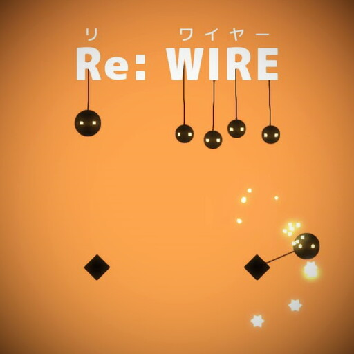

# Portfolio

- 田中　雄
- 連絡先 Twitter [@am1tanaka](https://twitter.com/am1tanaka) / Email [a@a.a](mailto:a@a.a)
- 専門学校デジタルアーツ東京 ゲームプログラムコース 2024年卒業予定

## スキル
- C#
  - 利用歴1年
  - Visual Studioで独自のツールの作成が可能
- Unity
  - 利用歴1年
  - オリジナルの個人/チーム作品の開発経験あり
- C/C++
  - 利用歴1年
  - コンソールで簡単なデータ処理プログラムを開発

## 取り組んでいるテーマ
1. オリジナルゲーム開発

## 作品リスト

### Re: WIRE

[Re: WIRE](https://am1tanaka.itch.io/wall-walker)

ひし形に糸を引っかけて、回転しながら家族のために食料を集めよう！

- 開発環境：Unity
- 開発期間：10日
- 総合 46位 / 斬新さ 16位 / 絵作り 37位 / サウンド 45位 / 雰囲気48位
  - 1週間ゲームジャム評価ランキング(https://unityroom.com/unity1weeks/57/top)より

## 連絡先
- ブログ [tanaka's Programming Memo](https://am1tanaka.hatenablog.com/)
- Twitter [@am1tanaka](https://twitter.com/am1tanaka)
- E-mail [a@a.a](mailto:a@a.a)
