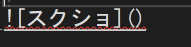

# 大見出し
## 中見出し
### 小見出し

普通の文字。

**太字**。

*斜体*。

~~取り消し~~

X<sub>2</sub>

X<sup>2</sup>

以下抜粋。

> ここに引用部分を書く。

整数は`int`型がよい。

```cs
int a;
a = 1;
Debug.Log($"a");
```

[README](README.md)へのリンク。



- 箇条書き
  - 段下げ
    - 段下げ２
- 続き

1. 順番１
   - 下げ
1. 順番２
   1. 順番2-1
   1. 順番2-2
1. 順番３

- [ ] 作業１
- [x] 作業２
- [ ] 作業３

|No|氏名|フリガナ|
|-:|:-:|:-|
|1|田中|タナカ|
|2|デジタルアーツ|デジタルアーツ|
|3|池袋|イケブクロ|

